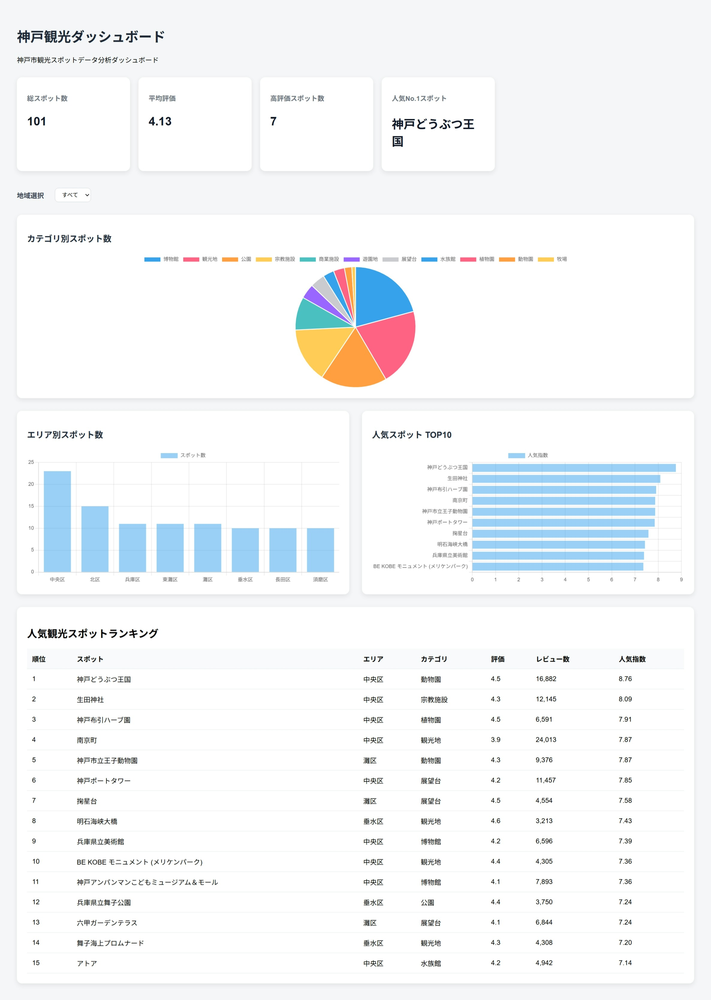
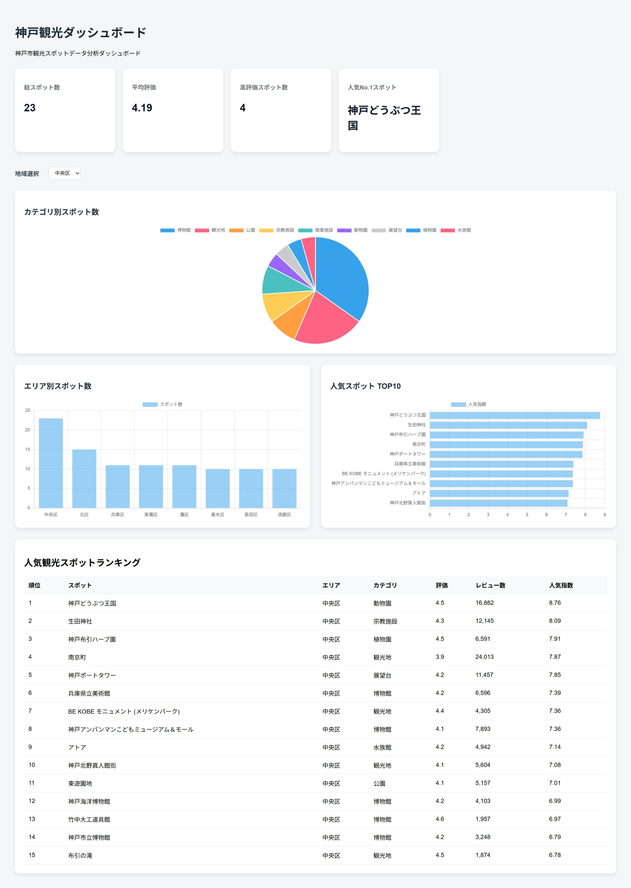
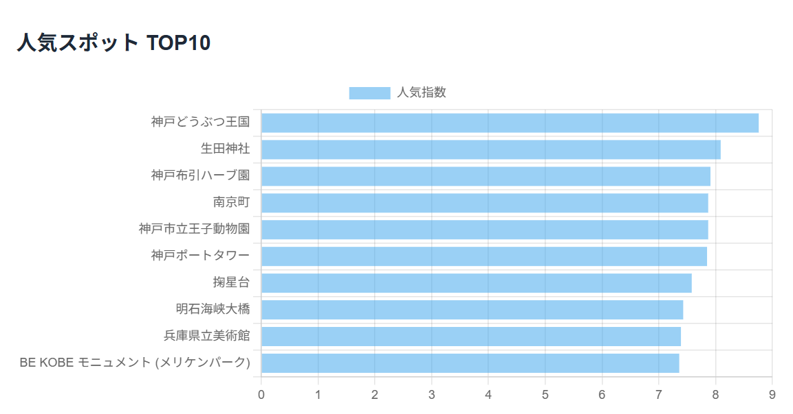
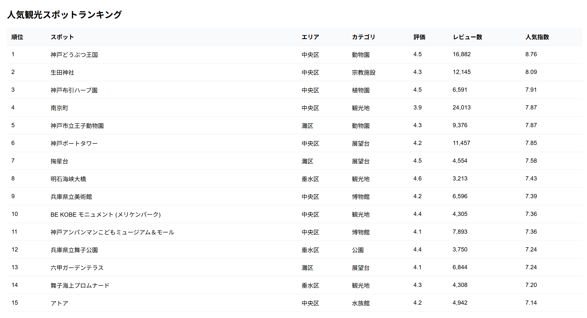

## 画面イメージ

### Dashboard Overview



---

### Area Filter



---

### 人気スポット TOP10



---

### 人気観光スポットランキング




# 神戸観光ダッシュボード

神戸市内の観光スポットデータを収集・分析し、可視化するダッシュボードアプリケーションです。

収集した観光スポット情報をPandasで集計・分析し、Flask APIを通じてChart.jsへ連携することで、エリア別の特徴や人気スポットを分かりやすく確認できるシステムを構築しました。

---

# 制作背景

神戸市には多くの観光スポットがありますが、エリアごとの特徴や人気スポットを比較できるデータを分かりやすく可視化したツールは多くありません。

そこで本作品では、神戸市内の観光スポット情報を収集し、Python（Pandas）によるデータ分析と Flask・Chart.js を用いた可視化を行うことで、観光スポットの人気度やエリア特性を把握できるダッシュボードを開発しました。

また、評価点数だけでなくレビュー件数も考慮した独自指標「人気指数（Popularity Score）」を設計し、より実態に近い人気ランキングを分析できるよう工夫しました。

---

# 使用技術

* Python
* Flask
* Pandas
* NumPy
* HTML
* CSS
* JavaScript
* Chart.js
* Excel
* Git
* GitHub

---

# 主な機能

## 1. KPI表示

以下の指標をリアルタイムで表示します。

* 総スポット数
* 平均評価
* 高評価スポット数
* 人気No.1スポット

---

## 2. カテゴリ別スポット分析

円グラフを使用して、神戸市内の観光スポットのカテゴリ分布を可視化しています。

例：

* 博物館
* 観光地
* 宗教施設
* 公園
* 展望台
* 水族館

---

## 3. エリア別スポット分析

神戸市各区の観光スポット数を棒グラフで可視化しています。

対象エリア：

* 中央区
* 灘区
* 東灘区
* 北区
* 須磨区
* 兵庫区
* 長田区
* 垂水区

---

## 4. 人気スポットランキング

独自指標「人気指数」を用いて、人気スポットTOP10を横棒グラフで表示しています。

---

## 5. エリアフィルター

地域を選択すると、

* KPI
* カテゴリ分析
* 人気スポットランキング
* 人気スポットランキング表

が自動更新されます。

Flask APIとJavaScriptを連携し、ページを再読み込みせずにデータを更新しています。

---

## 6. 人気観光スポットランキング表

人気指数順にランキングを表示します。

表示項目：

* 順位
* スポット名
* エリア
* カテゴリ
* 評価
* レビュー数
* 人気指数

---

# 人気指数（Popularity Score）

評価点数のみでランキングを作成すると、レビュー数が少ないスポットが上位に表示される可能性があります。

そのため、本作品では評価点数とレビュー件数を組み合わせた独自指標を設計しました。

計算式：

Popularity Score = (Rating ÷ 5) × log(Review Count + 1)

これにより、

* 高評価
* 多数のレビュー

の両方を満たすスポットを上位に評価できるようにしています。

---

# システム構成

```text
Excelデータ
        ↓
Pandas
        ↓
データ分析
        ↓
Flask API
        ↓
JSON
        ↓
JavaScript
        ↓
Chart.js
        ↓
Dashboard
```

---

# 工夫した点

## 1. 独自指標「人気指数」の設計

単純な評価点数ではなく、レビュー件数も考慮した独自指標を設計しました。

観光スポットの人気度をより実態に近い形で分析できるよう工夫しています。

---

## 2. フィルター連動機能

エリア選択に応じて、

* KPI
* グラフ
* ランキング表

が動的に更新される仕組みを実装しました。

Flask APIとJavaScriptの連携により、ユーザー操作に応じたリアルタイム分析を実現しています。

---

## 3. データ分析ダッシュボードの設計

KPI、グラフ、ランキング表を組み合わせ、企業向けの分析ダッシュボードを意識したUI構成を設計しました。

利用者が神戸市内の観光スポットの特徴や人気傾向を直感的に把握できるよう工夫しています。

---

# 今後の改善点

* 地図（Google Maps API）との連携
* スポット検索機能の追加
* データ自動収集機能の実装
* PDFレポート自動生成機能の追加
* AIによる観光分析コメント生成
